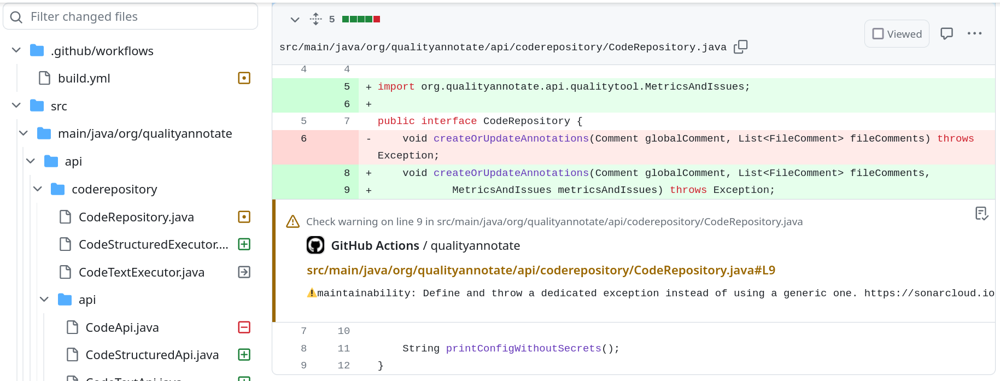
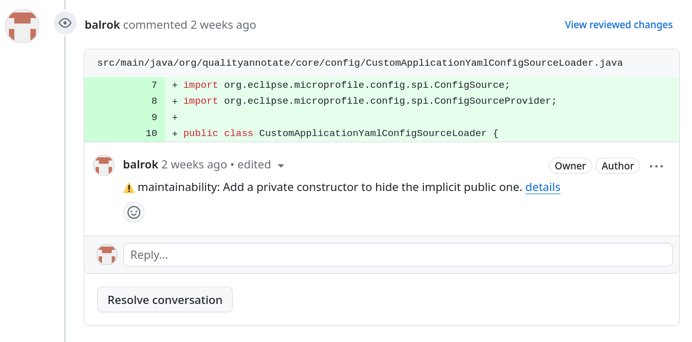

# Github integration

To use qualityannotate with github you can copy this into your github actions - right after you scanned via sonarqube.

```yml
jobs:
  qualityannotate:
    needs: build-native
    permissions:
      checks: write
    runs-on: ubuntu-latest
    steps:
      - uses: jwalton/gh-find-current-pr@v1
        id: findPr
        with:
          state: open
      - name: Qualityannotate
        uses: balrok/qualityannotate@v0
        if: success() && steps.findPr.outputs.number
        with:
          pullRequest: ${{ steps.findPr.outputs.pr }}
          githubToken: ${{ secrets.GITHUB_TOKEN }}
          githubProject: balrok/qualityannotate  # ${{env.GITHUB_ACTION_REPOSITORY}}
          sonarqubeProject: quyt_qualityannotate
          sonarqubeUrl: https://sonarcloud.io/
          sonarqubeToken: ${{ secrets.SONAR_TOKEN }}
```

## Checks-Api (Default)

By default the github checks api will be used. It will look like this:



## Comments

If `use_checks` is set to false, normal user-comments will be created. It will look like this:


